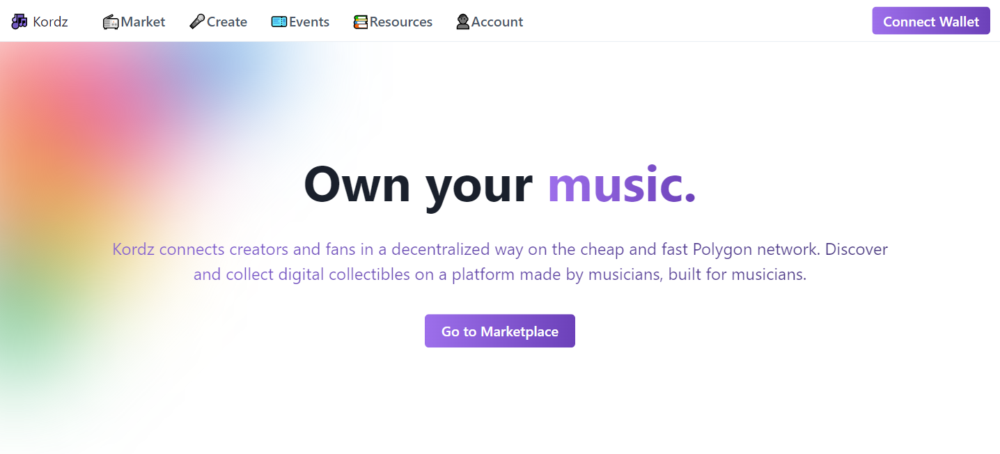

<!-- PROJECT LOGO -->
<br />
<div align="center">
    

  <h3 align="center">Kordz - MoleDAO Hackathon Submission</h3>

  <p align="center">
  A decentralized music owning platform built with Polygon. Power to the musicians.
    <br />
    <a href="https://stardust-explorer.metis.io/address/0x48575A330A942e6ca06aC54E38B038C3eD5Ef703/transactions">View Smart Contract on Stardust Explorer</a>
  </p>
</div>

<!-- TABLE OF CONTENTS -->
<details>
  <summary>Table of Contents</summary>
  <ol>
    <li>
      <a href="#about-the-project">About The Project</a>
      <ul>
        <li><a href="#built-with">Built With</a></li>
      </ul>
    </li>
    <li>
      <a href="#getting-started">Getting Started</a>
      <ul>
        <li><a href="#prerequisites">Prerequisites</a></li>
        <li><a href="#installation">Installation</a></li>
      </ul>
    </li>
    <li><a href="#usage">Usage</a></li>
    <li><a href="#roadmap">Roadmap</a></li>
    <li><a href="#license">License</a></li>
    <li><a href="#contact">Contact</a></li>
  </ol>
</details>

<!-- ABOUT THE PROJECT -->

## About The Project

**Kordz** is a simple but beautiful proof-of-concept of a decentralized music owning platform built with Polygon, aiming to reimagine how musicians earn a living and how fans discover new ways to connect with the music and each other. **Kordz** allows artists to sell digital songs to fans, who are then able to hold a digitally signed copy of your song (on the Polygon blockchain) that could be limited edition, or even a 1/1 edition. Kordz encourages fans who want to support their favorite artists to support them by creating unique digital assets.

In a world where only very few extremely popular artists can earn a sustainable full-time living, Kordz aims to disrupt the music industry by introducing the concept of royalties, making it more possible for more people to earn a living from their music.

It is built with Next.js, which offers blazing-fast server side rendering, and currently uses a Flask backend as temporary metadata storage. The smart contract is deployed on Polygon using the excellent Truffle suite, making deployments simple and easy.

### Built With

- Polygon Network
- Next.js
- Truffle
- Flask
- Chakra UI

<p align="right">(<a href="#top">back to top</a>)</p>

<!-- GETTING STARTED -->

## Getting Started

To get a local copy of **Kordz** up and running, please follow these steps.

### Prerequisites

- npm
  ```sh
  npm install npm@latest -g
  ```
- Truffle
  ```sh
  npm install truffle -g
  ```

### Installation

1. Clone the repo

   ```sh
   git clone https://github.com/0xFabray/kordz.git
   ```

2. Fill in `.env.example` (project root) with your mnemonic and private key, then rename it to `.env`.
3. Deploy smart contract
   ```sh
   truffle migrate --network matic
   ```
4. Run Next.js frontend
   ```sh
   cd client
   yarn install
   yarn dev
   ```
5. Run Flask backend
   ```sh
   cd server
   pip install -r requirements.txt
   flask run
   ```

<p align="right">(<a href="#top">back to top</a>)</p>

<!-- USAGE EXAMPLES -->

## Screenshots

<!-- [](images/create-screen.png)

[](images/create-screen.png)

Watch the demo here: https://vimeo.com/661321726 -->

<p align="right">(<a href="#top">back to top</a>)</p>

<!-- ROADMAP -->

## Roadmap

- [x] Add the Home section
- [x] Add the Create section
- [x] Add the Marketplace section
- [ ] Add the Events section
  - [ ] Artist Events
- [ ] Add the Ranking section

<p align="right">(<a href="#top">back to top</a>)</p>

<!-- LICENSE -->

## License

Distributed under the MIT License. See `LICENSE.md` for more information.

<p align="right">(<a href="#top">back to top</a>)</p>

## Contact

Callista Chang - [@0xFabray](https://twitter.com/0xFabray) - changcallista@gmail.com

Project Link: [https://github.com/0xFabray/kordz](https://github.com/0xFabray/kordz)

<p align="right">(<a href="#top">back to top</a>)</p>

<!-- ACKNOWLEDGMENTS -->

## Acknowledgments

A huge thank you to MoleDAO for this opportunity to develop something meaningful on the Polygon blockchain, and for exposing me to the world of Web3 through its lessons and resources.

<p align="right">(<a href="#top">back to top</a>)</p>
